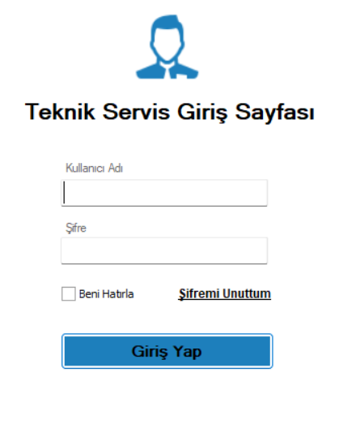
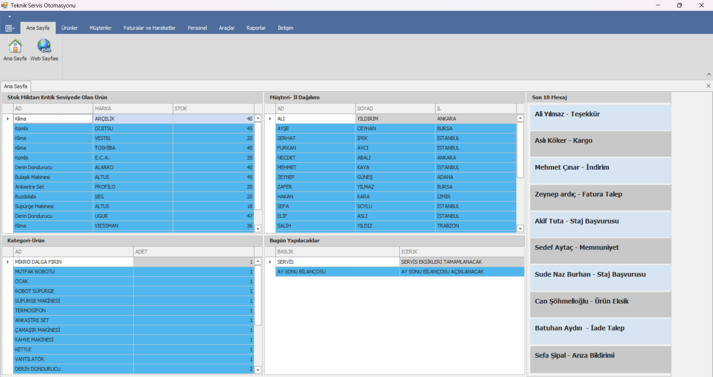
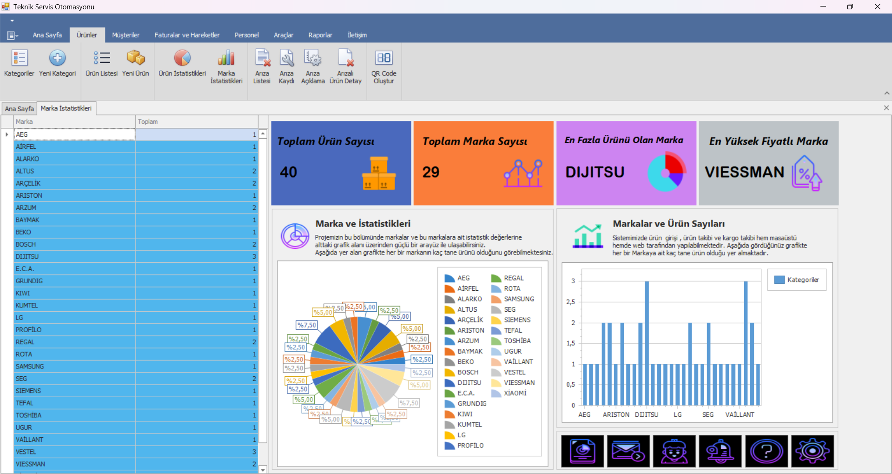

\# 🔧 Teknik Servis Otomasyonu — Masaüstü Uygulaması

Teknik Servis Otomasyonu Masaüstü Uygulaması, teknik servis firmalarının \*\*servis, müşteri, personel, stok, ürün ve raporlama\*\* süreçlerini tek merkezden yönetebilmesini sağlayan \*\*kurumsal seviyede\*\* bir otomasyon sistemidir.

Bu uygulama, web uygulaması ile \*\*aynı MSSQL veritabanını\*\* kullanır ve sistemin \*\*operasyonel çekirdeğini\*\* oluşturur.

---

\## 🎯 Projenin Amacı

Teknik servis firmalarında yaşanan:

\- dağınık servis kayıtları,

\- manuel personel takibi,

\- kontrolsüz stok yönetimi,

\- yetersiz raporlama

gibi problemleri ortadan kaldırmak ve tüm servis operasyonlarını \*\*kontrollü, izlenebilir ve raporlanabilir\*\* hale getirmek.

---

\- Masaüstü uygulama: \*\*aktif operasyon yönetimi\*\*

\- Web uygulaması: \*\*müşteri ve yönetim erişimi\*\*

\- Ortak veri tabanı sayesinde \*\*gerçek zamanlı senkronizasyon\*\*

---

\## ⚙️ Kullanılan Teknolojiler

\- \*\*C#\*\*

\- \*\*WinForms\*\*

\- \*\*.NET Framework 4.7.2\*\*

\- \*\*Entity Framework 6.5.1\*\*

\- \*\*MSSQL Server\*\*

\- \*\*MessagingToolkit.QRCode\*\*

-\*\*DevExpress 25.1\*\*

---

\## 🔐 Güvenlik \& Yetkilendirme

\- Kullanıcı giriş sistemi (Login)

\- Rol bazlı yetkilendirme:

&nbsp; - Admin

\*\*Varsayılan Admin Hesabı\*\*

Kullanıcı Adı: admin

Şifre: 123456

---

\## 🧩 Temel Özellikler

\### 🛠️ Servis Yönetimi

\- Arıza oluşturma

\- Arıza güncelleme

\- Arıza silme

\- Servis durumu ve aşama takibi

\- Personel / tekniker atama

\### 👥 Müşteri \& Personel Yönetimi

\- Müşteri kayıt ve takip

\- Personel yönetimi

\- Rol bazlı işlem kontrolü

\### 📦 Stok \& Ürün

\- Ürün ve marka yönetimi

\- Stok giriş / çıkış işlemleri

\- Ürün–servis ilişkilendirme

\- QR Code entegrasyonu

\### 📊 Raporlama \& Analiz

\- Servis istatistikleri

\- Personel performans raporları

\- Stok durum analizleri

\- Grafik ve tablo bazlı raporlama

\- \*\*Anlık kur bilgisi entegrasyonu\*\*

---

\## 🗄️ Veritabanı Yapısı

\- Yaklaşık \*\*35 tablo\*\*

\- Temel tablolar:

&nbsp; - Users

&nbsp; - Roles

&nbsp; - Customers

&nbsp; - Personnel

&nbsp; - Products

&nbsp; - Brands

&nbsp; - Services

&nbsp; - Faults

&nbsp; - StockMovements

&nbsp; - Logs

&nbsp; - Reports

---

\## 🛠️ Kurulum

1\. Reponun klonlanması:

* git clone https://github.com/firatysrgl/TeknikServisOtomasyonu.git

* MSSQL üzerinde yeni bir veritabanı oluştur.

* Repo içindeki SQL script dosyasını çalıştır.

* App.config içindeki ConnectionString alanını kendi SQL Server ortamına göre düzenle.

* Visual Studio üzerinden projeyi F5 ile çalıştır.

\## 📷 Ekran Görüntüleri

\### 🔐 Giriş Ekranı

\### 🏠 Anasayfa Ekranı

\### 🛠️ Ürün Yönetimi

\### 📊 İstatistikler Ekranı

👤 Geliştirici

Fırat Yunus Yaşaroğlu

📧 Email: firat9041@gmail.com

🔗 GitHub: https://github.com/firatysrgl

🔗 LinkedIn: https://www.linkedin.com/in/firat-yunus-yasaroglu/

